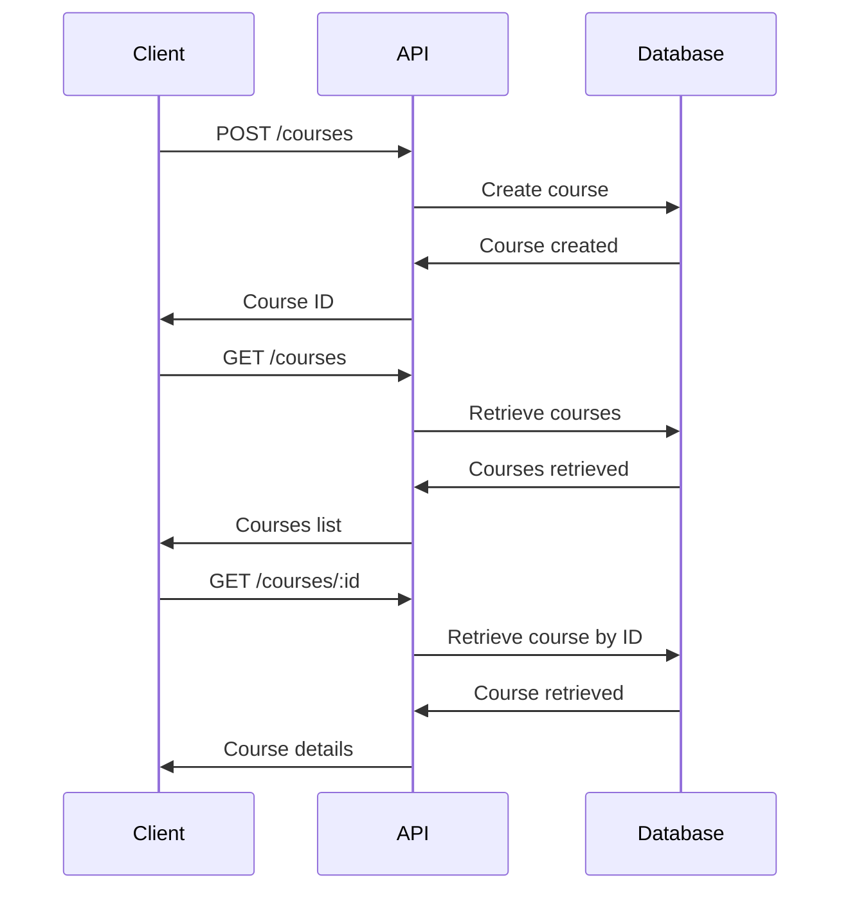

# Courses Platform API
=======================

A RESTful API for managing courses, built with Fastify and TypeScript.

### Overview

This API provides endpoints for creating, reading, and updating courses. It uses a PostgreSQL database to store course data.

### Features

* Create Course: Create a new course with a title and description
* Get All Courses: Retrieve a list of all courses
* Get Course by ID: Retrieve a single course by its ID

### Endpoints

#### POST /courses

* Create a new course
* Request Body: `{ title: string, description: string }`
* Response: `{ courseId: uuid }`

#### GET /courses

* Retrieve a list of all courses
* Response: `{ courses: [{ id: uuid, title: string, description: string }] }`

#### GET /courses/:id

* Retrieve a single course by its ID
* Response: `{ course: { id: uuid, title: string, description: string } }`

### Technologies

* **Fastify**: A fast and low-latency web framework for Node.js
* **TypeScript**: A superset of JavaScript that adds optional static typing
* **PostgreSQL**: A powerful, open-source relational database

### Database Schema

The database schema is defined in `drizzle.config.ts` and uses the Drizzle ORM.

### API Documentation

API documentation is generated using Fastify Swagger and can be found at `/docs`.

### Running the API

To run the API, execute the following command:

```bash
npm run dev
```

This will start the API in development mode, listening on port 3333.

### Environment Variables

The API requires the following environment variables to be set:

* `DATABASE_URL`: The URL of the PostgreSQL database

### Contributing

Contributions are welcome! Please submit a pull request with your changes.

### License

This project is licensed under the ISC License.

### System Flow



This diagram shows the main flow of the application, including the creation of a new course, retrieval of all courses, and retrieval of a single course by ID.